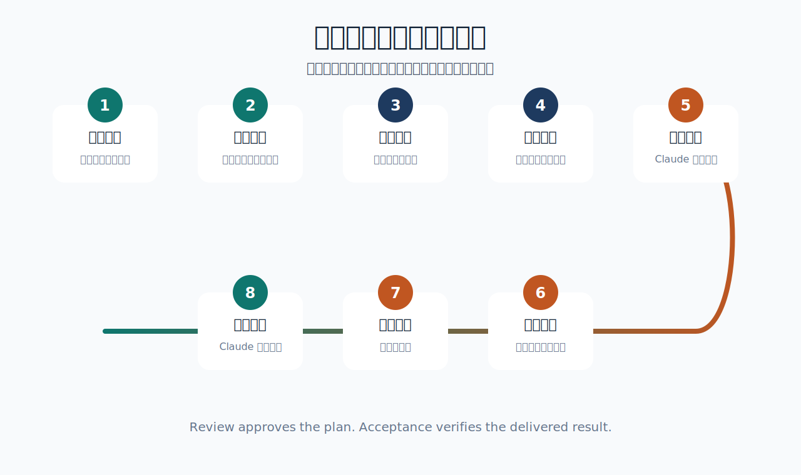

# 项目审建一体化 Skill：Claude 与 Codex 联合审查方案和验收项目


> 一个用于 Codex 的项目管理与实施流程 Skill，把“项目想法”推进到“调研论证、方案评审、对标决策、批准实施、项目验收”的完整闭环，并实现 Claude 与 Codex 联合审查项目方案、联合验收项目交付结果。

## 这是什么

**项目审建一体化** 是一个偏项目经理 + 实施专家的 Codex Skill。它的重点不是马上开工，而是先把项目想清楚、论证清楚、评审清楚，再经用户批准后实施，最后按证据验收。它特别加入了 **Claude 与 Codex 联合审查方案** 和 **Claude 与 Codex 联合验收项目** 两个协作环节。

它适合处理：

- 项目立项与可行性分析
- 项目调研、学习、论证
- 实施方案第一版撰写
- 方案评审、分析、评估、修改
- 类似项目对标和优劣比较
- 经用户同意后的实施推进
- 项目完成后的验收与关闭

## 流程图



## 核心流程

| 阶段 | 名称 | 产出 |
| --- | --- | --- |
| 1 | 项目主题提出 | 目标、用户、成果、约束、缺失信息 |
| 2 | 调研、学习和论证 | 可行性判断、事实依据、风险清单 |
| 3 | 双方沟通讨论 | 方向确认、关键问题、范围边界 |
| 4 | 实施方案第一版 | 范围、路径、里程碑、资源、验收标准 |
| 5 | 方案评审、分析、评估和修改 | 评审报告、修改意见、Claude 联合评审 |
| 6 | 类似项目对比与实施决策 | 对标矩阵、优劣判断、是否实施建议 |
| 7 | 经用户同意后实施 | 执行记录、阶段成果、验证证据 |
| 8 | 项目验收与关闭 | 验收报告、Claude 联合验收、关闭结论 |

## 两个关键边界

### 评审不是验收

**方案评审** 检查的是：这个方案能不能做、值不值得做、风险是否可控。

**项目验收** 检查的是：交付结果是否符合已批准方案和验收标准。

### Codex 不擅自开工

该 Skill 明确要求：

- 未经用户同意，不直接实施。
- 发现方案不完整，先补方案或提出修订。
- 实施中发现偏差，先暂停并提出方案变更。
- 项目完成后，必须按验收标准检查结果。

## Claude 联合评审与联合验收

这个 Skill 内置 Claude 外部复核环节。

### 启动 Claude 联合评审

用于第五步方案评审。Codex 会整理评审包，优先尝试通过本机 Claude CLI 调用 Claude；如果 Claude 不可用，会生成可复制到 Claude App 的评审提示词。

适合检查：

- 方案是否可行
- 风险是否遗漏
- 成本和周期是否现实
- 法律、合规、运营问题是否需要补充
- 是否有更稳妥的替代方案

### 启动 Claude 联合验收

用于第八步项目验收。Codex 会整理验收包，让 Claude 从外部角度检查交付物是否符合批准方案和验收标准。

适合检查：

- 交付物是否齐全
- 验收标准是否有证据支持
- 是否存在未完成项
- 是否可以通过、条件通过或不通过

Claude 的意见只作为外部参考，最终是否采纳、是否实施、是否验收由用户决定。

## 安装方式

将本仓库克隆到 Codex skills 目录，并使用内部 ID 作为目录名：

```bash
mkdir -p ~/.codex/skills
git clone https://github.com/<owner>/project-initiation-implementation-skill.git ~/.codex/skills/project-initiation-implementation
```

如果已经下载到本地，也可以把目录复制或改名为：

```bash
~/.codex/skills/project-initiation-implementation
```

## 使用方式

在 Codex 中直接说：

```text
用项目审建一体化，帮我评估一个项目
```

方案评审时：

```text
启动 Claude 联合评审
```

项目完成后：

```text
启动 Claude 联合验收
```

内部 Skill ID：

```text
project-initiation-implementation
```

## 文件结构

```text
.
├── SKILL.md
├── agents/
│   └── openai.yaml
├── references/
│   ├── acceptance-checklist.md
│   ├── comparison-framework.md
│   ├── implementation-plan-template.md
│   └── review-checklist.md
└── assets/
    ├── project-shenjian-cover.svg
    └── project-workflow.svg
```

## 适合的 GitHub Topics

```text
codex-skill
project-management
feasibility-study
implementation-plan
claude-review
acceptance-workflow
```

## 许可协议

MIT License
