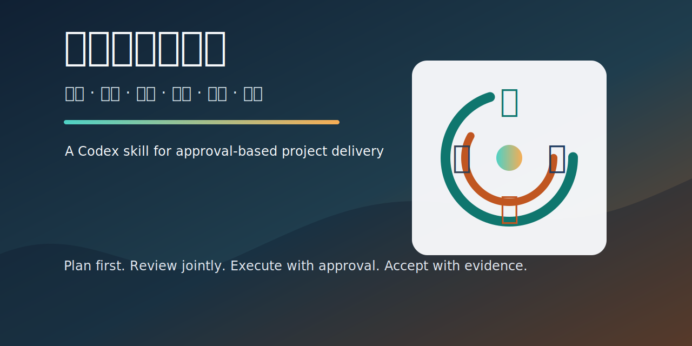

# 项目审建一体化 Skill



一个用于 Codex 的项目管理与实施流程 Skill，帮助把项目从“想法”推进到“调研论证、方案评审、对标决策、批准实施、项目验收”的完整闭环。

## 适用场景

- 提出一个项目主题，需要判断是否值得做
- 需要进行项目调研、学习、论证和风险分析
- 需要撰写第一版项目实施方案
- 需要对方案进行评审、评估、修改
- 需要对比类似项目，判断优劣和实施价值
- 需要在用户明确同意后按方案实施
- 需要项目完成后的验收与关闭

## 核心流程

1. **项目主题提出**：明确目标、用户、成果、约束和缺失信息。
2. **调研、学习和论证**：分析市场、技术、成本、法律合规、风险和类似项目。
3. **双方沟通讨论**：先确认研究结论、关键假设和范围，不直接跳到实施。
4. **实施方案第一版**：形成目标、范围、路径、里程碑、资源、风险和验收标准。
5. **方案评审、分析、评估和修改**：检查方案是否可行、可控、可验收。
6. **类似项目对比与实施决策**：比较优劣，判断继续、缩小、暂停或放弃。
7. **经用户同意后实施**：只按批准方案执行，发现重大偏差先修订方案。
8. **项目验收与关闭**：根据批准方案和验收标准检查交付结果。

## Claude 联合评审与联合验收

该 Skill 内置两个外部复核环节：

- **启动 Claude 联合评审**：用于第五步方案评审。Codex 会整理评审包，优先尝试通过本机 Claude CLI 调用 Claude；如果 Claude 不可用，会生成可复制到 Claude App 的评审提示词。
- **启动 Claude 联合验收**：用于第八步项目验收。Codex 会整理验收包，让 Claude 从外部角度检查交付物是否符合批准方案和验收标准。

Claude 的意见只作为外部参考，最终是否采纳、是否实施、是否验收由用户决定。

## 安装方式

将本仓库克隆到 Codex skills 目录，并使用内部 ID 作为目录名：

```bash
mkdir -p ~/.codex/skills
git clone https://github.com/<owner>/project-initiation-implementation-skill.git ~/.codex/skills/project-initiation-implementation
```

如果已经下载到本地，也可以把目录复制或改名为：

```bash
~/.codex/skills/project-initiation-implementation
```

## 使用方式

在 Codex 中可以直接说：

```text
用项目审建一体化，帮我评估一个项目
```

也可以在特定阶段说：

```text
启动 Claude 联合评审
```

```text
启动 Claude 联合验收
```

内部 Skill ID：

```text
project-initiation-implementation
```

## 文件结构

```text
.
├── SKILL.md
├── agents/
│   └── openai.yaml
├── references/
│   ├── acceptance-checklist.md
│   ├── comparison-framework.md
│   ├── implementation-plan-template.md
│   └── review-checklist.md
└── assets/
    └── project-shenjian-cover.svg
```

## 许可协议

MIT License
